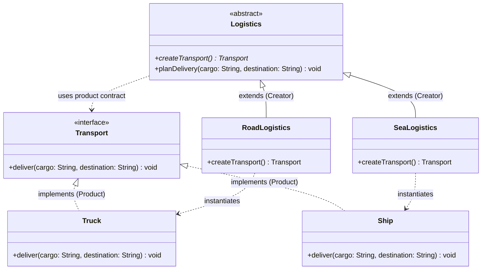
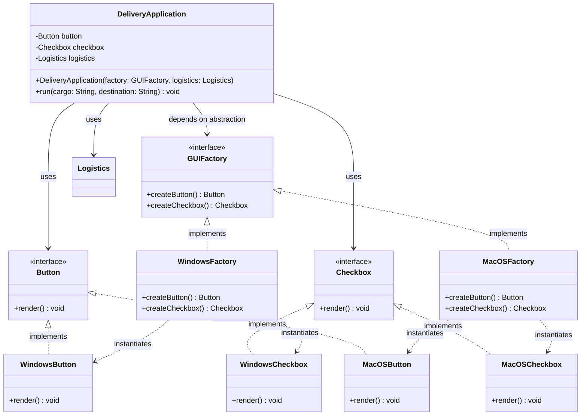

# Assignment 2 Report: Factory Method and Abstract Factory

**Course:** ShP-2216 Software Design Patterns  
**Programme:** Software Engineering | Year 2, Trimester 4  
**Student Name:** Dias Tursynbay  
**Group:** SE-2401  
**GitHub Repository:** [https://github.com/HumbleCherry10/SDP-assignment2.git](https://github.com/HumbleCherry10/SDP-assignment2.git)  

---

## 1. Introduction

The objective of this assignment is to design and build a cross-platform Java logistics application that integrates two fundamental creational design patterns: **Factory Method** and **Abstract Factory**.

- **Factory Method** is applied to manage the creation of transport objects (`Truck` for road delivery and `Ship` for sea delivery). It encapsulates object creation within creator subclasses (`RoadLogistics` and `SeaLogistics`), allowing the central delivery planning workflow (`Logistics.planDelivery`) to remain decoupled from concrete transport implementations.
- **Abstract Factory** is applied to create families of matching UI components (`Button` and `Checkbox`) for different platforms (`Windows` and `macOS`). The client (`DeliveryApplication`) interacts purely with product interfaces (`Button`, `Checkbox`) and factory interface (`GUIFactory`), guaranteeing UI family consistency without hardcoding concrete constructors.

---

## 2. Architecture & UML Class Diagrams

### 2.1 Factory Method Pattern Diagram



- **Product:** `Transport`
- **Concrete Products:** `Truck`, `Ship`
- **Creator:** `Logistics` (declares factory method `createTransport()` and provides `planDelivery(...)`)
- **Concrete Creators:** `RoadLogistics`, `SeaLogistics`

---

### 2.2 Abstract Factory Pattern Diagram



- **Abstract Products:** `Button`, `Checkbox`
- **Concrete Product Families:** Windows (`WindowsButton`, `WindowsCheckbox`) and macOS (`MacOSButton`, `MacOSCheckbox`)
- **Abstract Factory:** `GUIFactory`
- **Concrete Factories:** `WindowsFactory`, `MacOSFactory`
- **Client:** `DeliveryApplication`

---

## 3. Clean Code Evidence & Justifications

The implementation applies five key Clean Code practices from Robert C. Martin's *Clean Code*:

### Excerpt 1: Meaningful Names
```java
public class RoadLogistics extends Logistics {
    @Override
    public Transport createTransport() {
        return new Truck();
    }
}
```
**Explanation & Benefit:** Class names (`RoadLogistics`, `Logistics`, `Transport`, `Truck`) clearly express their specific domain and pattern roles. There are no ambiguous abbreviations or generic names like `Manager1` or `DataHandler`.

### Excerpt 2: Small Methods & Single Responsibility
```java
private static Logistics createLogistics(String deliveryMode) {
    if (deliveryMode == null) return null;
    return switch (deliveryMode.toUpperCase()) {
        case "ROAD" -> new RoadLogistics();
        case "SEA" -> new SeaLogistics();
        default -> null;
    };
}
```
**Explanation & Benefit:** Method `createLogistics` handles strictly one responsibility (mapping mode strings to creator instances). Parsing, input reading, object assembly, and error output are decoupled into distinct small helper methods.

### Excerpt 3: Avoid Duplicated Logic
```java
public abstract class Logistics {
    public abstract Transport createTransport();

    public void planDelivery(String cargo, String destination) {
        Transport transport = createTransport();
        transport.deliver(cargo, destination);
    }
}
```
**Explanation & Benefit:** The delivery execution sequence (`createTransport()` followed by `transport.deliver(...)`) is defined once in the base `Logistics` class. Subclasses do not duplicate this workflow; they only override the object creation logic.

### Excerpt 4: Data Abstraction (Clean Code, Chapter 6)
```java
public class DeliveryApplication {
    private final Button button;
    private final Checkbox checkbox;
    private final Logistics logistics;

    public DeliveryApplication(GUIFactory factory, Logistics logistics) {
        this.button = factory.createButton();
        this.checkbox = factory.createCheckbox();
        this.logistics = logistics;
    }
}
```
**Explanation & Benefit:** (Chapter 6 Focus) The client code operates entirely on abstract contracts (`GUIFactory`, `Button`, `Checkbox`, `Logistics`). It does not reference concrete implementation classes (`WindowsButton`, `Truck`, etc.) or internal details. Callers interact through abstract boundaries without depending on implementation details.

### Excerpt 5: Objects and Encapsulation (Clean Code, Chapter 6)
```java
public void run(String cargo, String destination) {
    button.render();
    checkbox.render();
    logistics.planDelivery(cargo, destination);
}
```
**Explanation & Benefit:** (Chapter 6 Focus) Objects expose behavior (`render()`, `planDelivery()`) rather than exposing internal data structure accessors or getters/setters. The fields `button`, `checkbox`, and `logistics` are `private final` and encapsulated within the client object.

---

## 4. Verification Evidence & Test Results

All six required test cases were executed on JDK 17 with actual console output recorded below:

| Check | Input Configuration | Expected Result | Actual Result / Console Transcript | Status |
|---|---|---|---|---|
| **1** | `ROAD + WINDOWS` | Truck delivery; Windows button & checkbox | `Delivery mode: ROAD`<br>`UI platform: WINDOWS`<br>`Rendering Windows button`<br>`Rendering Windows checkbox`<br>`Truck delivers laboratory equipment to Aktau warehouse` | **PASS** |
| **2** | `SEA + WINDOWS` | Ship delivery; Windows button & checkbox | `Delivery mode: SEA`<br>`UI platform: WINDOWS`<br>`Rendering Windows button`<br>`Rendering Windows checkbox`<br>`Ship delivers laboratory equipment to Aktau warehouse` | **PASS** |
| **3** | `ROAD + MACOS` | Truck delivery; macOS button & checkbox | `Delivery mode: ROAD`<br>`UI platform: MACOS`<br>`Rendering macOS button`<br>`Rendering macOS checkbox`<br>`Truck delivers laboratory equipment to Aktau warehouse` | **PASS** |
| **4** | `SEA + MACOS` | Ship delivery; macOS button & checkbox | `Delivery mode: SEA`<br>`UI platform: MACOS`<br>`Rendering macOS button`<br>`Rendering macOS checkbox`<br>`Ship delivers laboratory equipment to Aktau warehouse` | **PASS** |
| **5** | `AIR + WINDOWS` (Unsupported Delivery) | Clear validation message; stop cleanly | `Error: Unsupported or missing delivery mode 'AIR'. Allowed values: ROAD, SEA.` | **PASS** |
| **6** | `ROAD + LINUX` (Unsupported Platform) | Clear validation message; stop cleanly | `Error: Unsupported or missing UI platform 'LINUX'. Allowed values: WINDOWS, MACOS.` | **PASS** |

### Missing Input Behavior
When executed without command-line arguments, the application prompts the user interactively:
```
=== Logistics Application Startup ===
Enter Delivery Mode (ROAD / SEA): ROAD
Enter UI Platform (WINDOWS / MACOS): WINDOWS
Delivery mode: ROAD
UI platform: WINDOWS
Rendering Windows button
Rendering Windows checkbox
Truck delivers laboratory equipment to Aktau warehouse
```
If empty or invalid input is provided during interactive mode, a clear error message is printed and execution halts cleanly without crashing or using silent defaults.

---

## 5. Conclusion & Design Reflection

### 5.1 Simple Factory vs. Factory Method
- **Simple Factory:** Uses a single class with conditional logic (`if` / `switch`) to construct objects. It violates the Open/Closed Principle (OCP) because adding new product types requires modifying existing factory code.
- **Factory Method:** Uses inheritance and polymorphism. Concrete creators subclass a base creator and override the factory method. Adding a new product requires creating a new subclass without modifying existing creator classes.

### 5.2 Factory Method vs. Abstract Factory
- **Factory Method:** Focuses on creating **a single product type** (`Transport`) across a single class hierarchy.
- **Abstract Factory:** Focuses on creating **families of related products** (`Button` and `Checkbox`) without specifying their concrete classes, ensuring platform consistency.

### 5.3 Extension Analysis (Design Reflection)
1. **Adding a new transport (e.g., `AirLogistics` / `Plane`):**
   - Create `Plane` implementing `Transport`.
   - Create `AirLogistics` extending `Logistics` overriding `createTransport()`.
   - Update startup configuration switch in `Main`.
   - **Unchanged:** `Logistics`, `Transport`, `DeliveryApplication`, and all existing transport classes.
2. **Adding a new UI family (e.g., Linux UI):**
   - Create `LinuxButton` implementing `Button` and `LinuxCheckbox` implementing `Checkbox`.
   - Create `LinuxFactory` implementing `GUIFactory`.
   - Update startup selection switch in `Main`.
   - **Unchanged:** `GUIFactory`, `Button`, `Checkbox`, `DeliveryApplication`, and existing factories.
3. **Adding a new UI product type (e.g., `TextField`):**
   - Create `TextField` interface.
   - Create concrete classes: `WindowsTextField`, `MacOSTextField`.
   - Add `createTextField()` declaration to `GUIFactory` interface.
   - Implement `createTextField()` in `WindowsFactory` and `MacOSFactory`.
   - Update `DeliveryApplication` client constructor and `run()` method to render `TextField`.
   - **Unchanged:** Factory Method logistics code, existing product implementations (`Button`, `Checkbox`).

---

## 6. References

1. Freeman, E., & Robson, E. (2020). *Head First Design Patterns: Building Extensible and Maintainable Object-Oriented Software* (2nd ed.). O'Reilly Media.
2. Martin, R. C. (2008). *Clean Code: A Handbook of Agile Software Craftsmanship* (Chapter 6: Objects and Data Structures). Prentice Hall.
3. Gamma, E., Helm, R., Johnson, R., & Vlissides, J. (1994). *Design Patterns: Elements of Reusable Object-Oriented Software*. Addison-Wesley.
