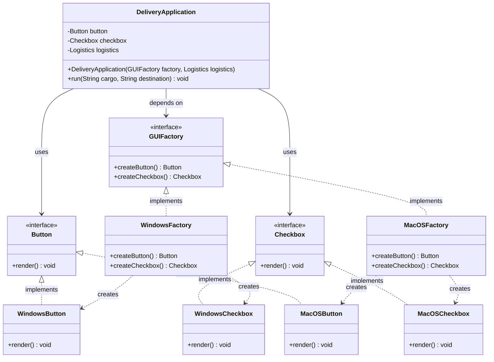

# Abstract Factory Pattern Class Diagram

```mermaid
classDiagram
    class Button {
        <<interface>>
        +render() void
    }

    class Checkbox {
        <<interface>>
        +render() void
    }

    class WindowsButton {
        +render() void
    }

    class MacOSButton {
        +render() void
    }

    class WindowsCheckbox {
        +render() void
    }

    class MacOSCheckbox {
        +render() void
    }

    class GUIFactory {
        <<interface>>
        +createButton() Button
        +createCheckbox() Checkbox
    }

    class WindowsFactory {
        +createButton() Button
        +createCheckbox() Checkbox
    }

    class MacOSFactory {
        +createButton() Button
        +createCheckbox() Checkbox
    }

    class DeliveryApplication {
        -Button button
        -Checkbox checkbox
        -Logistics logistics
        +DeliveryApplication(GUIFactory factory, Logistics logistics)
        +run(String cargo, String destination) void
    }

    Button <|.. WindowsButton : implements
    Button <|.. MacOSButton : implements
    Checkbox <|.. WindowsCheckbox : implements
    Checkbox <|.. MacOSCheckbox : implements

    GUIFactory <|.. WindowsFactory : implements
    GUIFactory <|.. MacOSFactory : implements

    WindowsFactory ..> WindowsButton : creates
    WindowsFactory ..> WindowsCheckbox : creates
    MacOSFactory ..> MacOSButton : creates
    MacOSFactory ..> MacOSCheckbox : creates

    DeliveryApplication --> GUIFactory : depends on
    DeliveryApplication --> Button : uses
    DeliveryApplication --> Checkbox : uses
```
