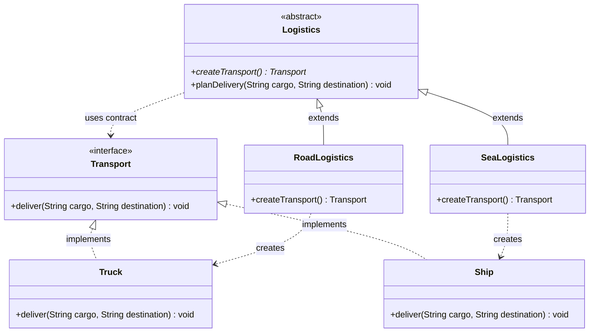

# Factory Method Pattern Class Diagram

```mermaid
classDiagram
    class Transport {
        <<interface>>
        +deliver(String cargo, String destination) void
    }

    class Truck {
        +deliver(String cargo, String destination) void
    }

    class Ship {
        +deliver(String cargo, String destination) void
    }

    class Logistics {
        <<abstract>>
        +createTransport()* Transport
        +planDelivery(String cargo, String destination) void
    }

    class RoadLogistics {
        +createTransport() Transport
    }

    class SeaLogistics {
        +createTransport() Transport
    }

    Transport <|.. Truck : implements
    Transport <|.. Ship : implements
    Logistics <|-- RoadLogistics : extends
    Logistics <|-- SeaLogistics : extends
    RoadLogistics ..> Truck : creates
    SeaLogistics ..> Ship : creates
    Logistics ..> Transport : uses contract
```
